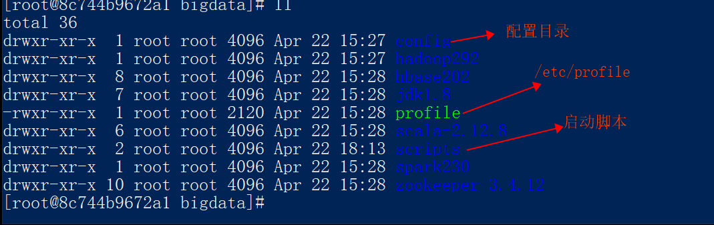
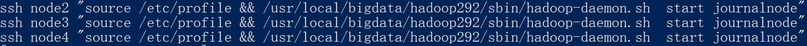
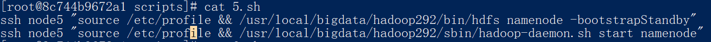
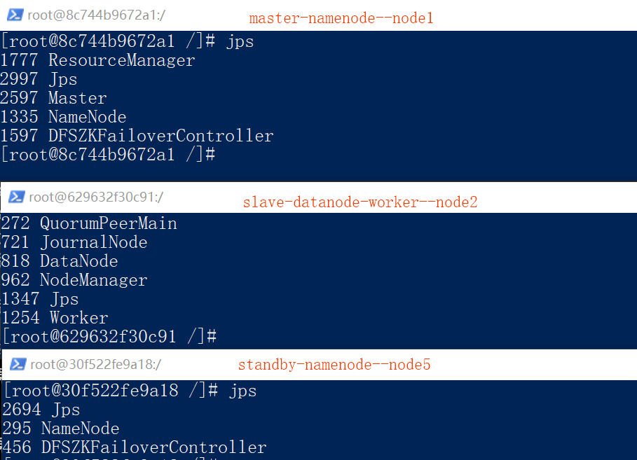

***软件***

//环境变量
export JAVA_HOME=/usr/local/bigdata/jdk1.8
export SCALA_HOME=/usr/local/bigdata/scala-2.12.8
export HADOOP_HOME=/usr/local/bigdata/hadoop292
export HBASE_HOME=/usr/local/bigdata/hbase202
export SPARK_HOME=/usr/local/bigdata/spark230
export ZOOKEEPER_HOME=/usr/local/bigdata/zookeeper-3.4.12
export PATH=$JAVA_HOME/bin:$SCALA_HOME/bin:$HADOOP_HOME/bin:$HADOOP_HOME/sbin:$HBASE_HOME/bin:$HBASE_HOME/sbin:$SPARK_HOME/bin:$SPARK_HOME/sbin:$ZOOKEEPER_HOME/bin:$PATH
***/ect/profile文件***
172.10.1.1      node1
172.10.1.2      node2
172.10.1.3      node3
172.10.1.4      node4
172.10.1.5      node5
***启动步骤***
第一步、启动所有journalNode进程，用来存之后namenode的元数据
	hadoop-daemons.sh start journalnode
	或者
	
第二步、格式化主namenode，并启动主namenode进程
	格式化
	hdfs namenode -format(之第一次执行)
	启动==主==namenode
	hadoop-daemon.sh start namenode
第三步、将主namenode上的元数据信息复制到从的namenode所在节点
	并启动==备==namenode
	
第四步、在主namenode上格式化ZKFC，只需要在主namenode上进行即可，原因后面有解释
	
第五步
	在active的namenode上执行 hadoop-daemon.sh start zkfc
第六步
	启动datanode
	ssh node2 "source /etc/profile && /usr/local/bigdata/hadoop292/sbin/hadoop-daemon.sh  start datanode"
	ssh node3 "source /etc/profile && /usr/local/bigdata/hadoop292/sbin/hadoop-daemon.sh  start datanode"
	ssh node4 "source /etc/profile && /usr/local/bigdata/hadoop292/sbin/hadoop-daemon.sh  start datanode"
其他命令
	启动yarn
		start-yarn.sh	
	启动spark
		start-spark-all.sh
进程图
	
==待定
	第五步、停掉所有Journalnode进程和主namenode
		hadoop-daemons.sh stop namenode
		hadoop-daemons.sh stop journalnode
	第六步、使用start-dfs.sh脚本一次性启动所有HDFS的进程
		dfs-start.sh==

