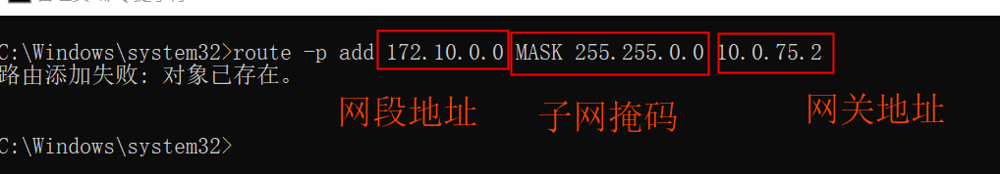

一.主机与容器互连
	1.Docker的默认启动方式中，会产生一块虚拟网卡，然后容器内自行分配单独的网卡和IP。可以在宿主机上通过ipconfig命令看到这个虚拟网卡
		
	2.打开一个容器,可以看到容器IP为自动分配的
		
		==此时无法ping通==
	3.配置路由表实现ip互通
		
		此时可以ping通
		
	4.docker默认使用bridge网络,每次容器启动时自动分配ip,我们可以创建自己的网络bridge1,在创建容器时指定ip,如需独立ip访问则需要新增路由
		docker network create --subnet=172.10.0.0/16 redis-net
		
		然后就可以ip互连了
		
二.ssh远程连接docker容器
	 ==如果不通,需要修改容器的配置文件==
	 vim /etc/ssh/sshd_config
	 PermitRootLogin without-password 改为 PermitRootLogin yes
	 PasswordAuthentication yes 改为 PasswordAuthentication yes
